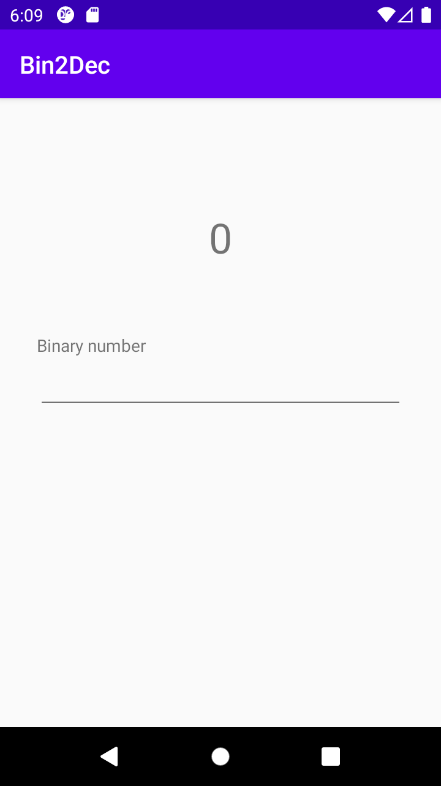
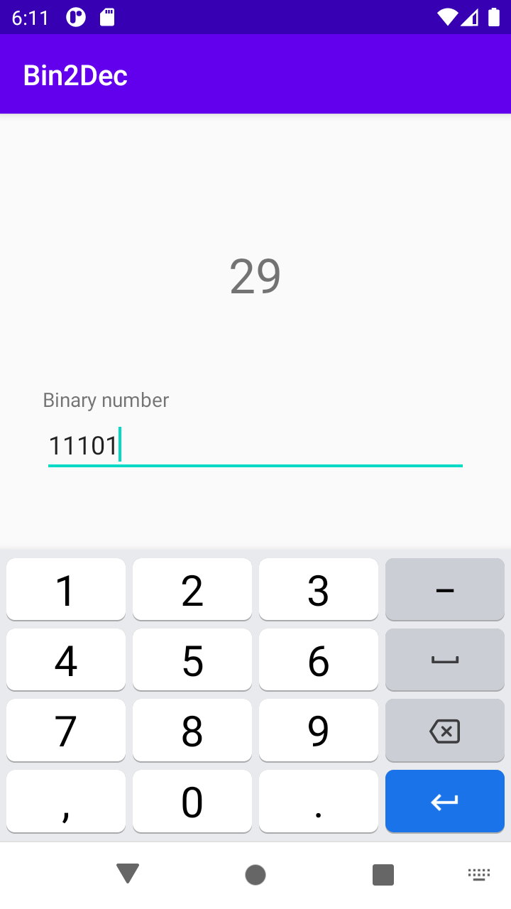

# Bin2Dec

This project is a simple Binary to Decimal number converter for android written in Kotlin. This project was build to practice data binding features in android applications.

|                                    |                                    |
| ---------------------------------- | ---------------------------------- |
|  |  |

